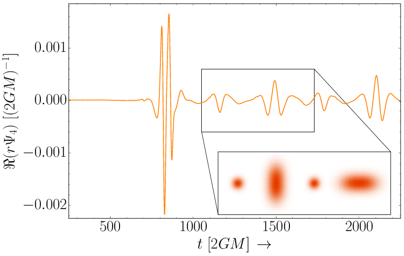
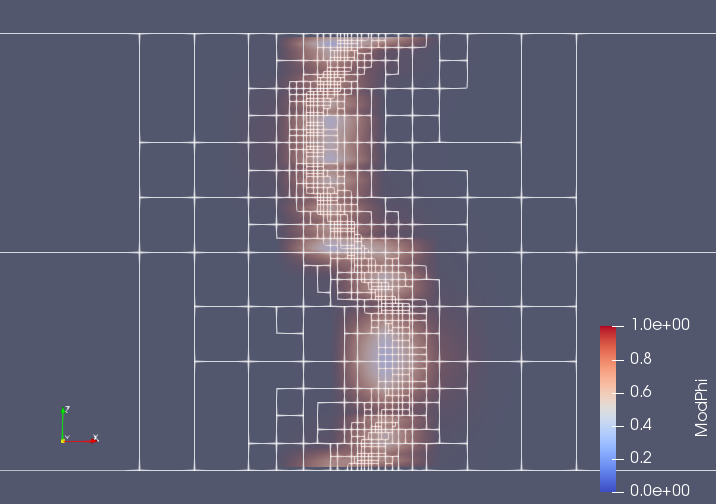

**The paper should be between 250 and 1000 words.**

# Summary

**A summary describing the high-level functionality and purpose of the software for a diverse, non-specialist audience.**

The 2015 detection of gravitational waves (GWs) from a binary black hole merger by the LIGO/VIRGO GW detector [@Abbott:2016blz] was a breakthrough moment for science. To fully understand the theoretical predictions from Einstein's Theory of General Relativity requires the use of *numerical relativity* (NR) -- i.e. using high performance computing to solve the Einstein Field Equations [@Einstein:1916vd] numerically:
\begin{equation}
   R_{\mu \nu} - \frac{1}{2} R g_{\mu \nu} = 8 \pi G T_{\mu\nu} ~.
\end{equation}
This concise form obscures the nature of the equations from those unfamiliar with the notation - expanded out, it is a set of second order partial differential equations for the metric tensor field $g_{\mu\nu}$, which describes the curvature of spacetime in the presence of matter with stress-energy $T_{\mu\nu}$, i.e.
\begin{equation}
   \partial_t \partial_t g_{\mu\nu} = \partial_x \partial_x g_{\mu\nu} + \partial_y \partial_y g_{\mu\nu} + \partial_z \partial_z g_{\mu\nu} + {\rm non ~ linear ~ cross ~ terms} 
          + 8 \pi G T_{\mu\nu}
\end{equation}
where the indices $\mu, \nu$ run over the spacetime indices - in 4 dimensions, $t, x, y, z$. Given that $g_{\mu\nu}$ is symmetric in its indices, this gives a set of ten coupled, non linear wave equations, sourced by the stress-energy of any matter present in the spacetime.

Aalytic solutions to the Einstein equation are rare and in general the equations must be solved numerically. One common approach to this problem is to specify an initial spatial distribution for the metric and matter fields (subject to certain constraints), and then solve a time evolution for all metric and matter quantities, thus populating their values thoughout the four dimensional spacetime. The canonical example of this is the simulation of two black holes in orbit around each other, which permits extraction of the gravitational wave signal produced during the merger. Such numerical results have been instrumental in discovering signals in the noisy LIGO/VIRGO detector data, as well as confirming the predictions of GR to a high precision in the strong field regime.

GRChombo is an open-source code for performing NR time evolutions. Whilst GRChombo uses standard techniques in NR, it focusses on applications in theoretical physics where adaptability, both in terms of grid structure, and in terms of code modification, are key drivers. 

# Key features of GRChombo

Since its first initial announcement in 2015 [@Clough:2015sqa], the GRChombo code has become a fully mature, open source NR resource.

The key features of GRChombo are as follows:

- BSSN/CCZ4 formalism with moving puncture: GRChombo evolves the Einstein equation in the BSSN [@Nakamura:1987zz;@Shibata:1995we;@Baumgarte:1998te] or CCZ4 [@Gundlach:2005eh;@Alic:2011gg] formalism with conformal factor $\chi = det(\gamma_{ij})^{-1/3}$. Singularities of black holes are managed using the moving puncture gauge conditions [@Campanelli:2005dd;@Baker:2005vv], and Kreiss-Oliger dissipation is used to control errors, both from truncation and the interpolation associated with regridding.

- Boundary Conditions: The code implements periodic, Sommerfeld (radiative), extrapolating and reflective boundary conditions.

- Initial Conditions: The current examples provide analytic initial data for black hole binaries and Kerr black holes and for scalar matter.

- Diagnostics: GRChombo has routines for finding black hole horizons, calculating spacetime masses, angular momenta, densities, fluxes and extracting gravitational waves. 

- C++ class structure: GRChombo is written in the C++ language, and makes heavy use of object oriented programming (OOP) and templating.

- Parallelism: GRChombo uses hybrid OpenMP/MPI  parallelism with explicit vectorisation of the evolution equations via intrinsics, and is AVX-512 compliant. Our code scales efficiently to several thousand CPU-cores. 

- Adaptive Mesh Refinement: Chombo provides Berger-Oliger style [@Berger:1984zza] AMR with block-structured  Berger-Rigoutsos grid generation.

# Statement of Need
 
**A clear Statement of Need that illustrates the research purpose of the software. The software should have an obvious research application. The software should be a significant contribution to the available open source software that either enables some new research challenges to be addressed or makes addressing research challenges significantly better (e.g., faster, easier, simpler). The software should be feature-complete (no half-baked solutions) and designed for maintainable extension (not one-off modifications). Include a list of key references, including to other software addressing related needs.**

While GRChombo is not the first open sourced NR code (e.g. the Einstein Toolkit (http://einsteintoolkit.org/), it incorporate several unique features as detailed above which has made it one of the premier code for numerical relativity, especially in the study of fundamental physics beyond standard black holes or neutron stars mergers. In particular, GRChombo's highly flexiible adaptive mesh refinement scheme allows for complicated ``many-boxes-in-many-boxes'' topology , enabling users to simulate non-trivial systems (such as ring configurations @Helfer:2018qgv) beyond the standard binary mergers. Nevertheless, we envisage that with its extreme scalability and AMR capabilities, it will play a leading role in the continuing efforts to simulate ``standard'' binary mergers to the required sensitivities required for the upcoming LISA space mission. Finally, GRChombo's object-oriented and template base code base allows for rapid modification for non-standard problems such as higher dimensional (Cite Pau papers) or modified gravity systems.

# Key research projects using GRChombo

**Mention (if applicable) a representative set of past or ongoing research projects using the software and recent scholarly publications enabled by it.**

/*: GRChombo is developed and maintained by a collaboration of numerical relativists with a wide range of research interests, from early universe cosmology to astrophysics and mathematical general relativity, and has been used in many papers to date. :*/

The fundamental physics problems for which the code has been used include:

- the simulation of pre-inflationary spacetimes in early universe cosmology [@Aurrekoetxea:2019fhr;@Clough:2017efm;@Clough:2016ymm].

{ width=60% }

- the study of modified gravity, and violation of cosmic censorship [@Figueras:2020dzx;@Bantilan:2019bvf;@Figueras:2017zwa;@Figueras:2015hkb].

{ width=60% }

- the formation, collapse and collisions of exotic compact objects (ECOs) and dark matter stars [@Muia:2019coe;@Widdicombe:2019woy;@Clough:2018exo;@Dietrich:2018bvi;@Helfer:2018vtq;@Helfer:2016ljl].

{ width=60% }

- Gravitational wave emission from cosmic string collapse [@Helfer:2018qgv] and cosmic string networks [@Drew:2019mzc].

{ width=60% }

- The study of light bosonic dark matter and neutrino-like particles in black holes environments [@Alexandre:2018crg;@Clough:2019jpm].

{ width=60% }

# Acknowledgements

The GRChombo collaboration acknowledges support to its members by The Royal Society, ERC, UKRI/STFC, INTEL, PRACE and DiRAC.
**(Add more detail?)**

# References
